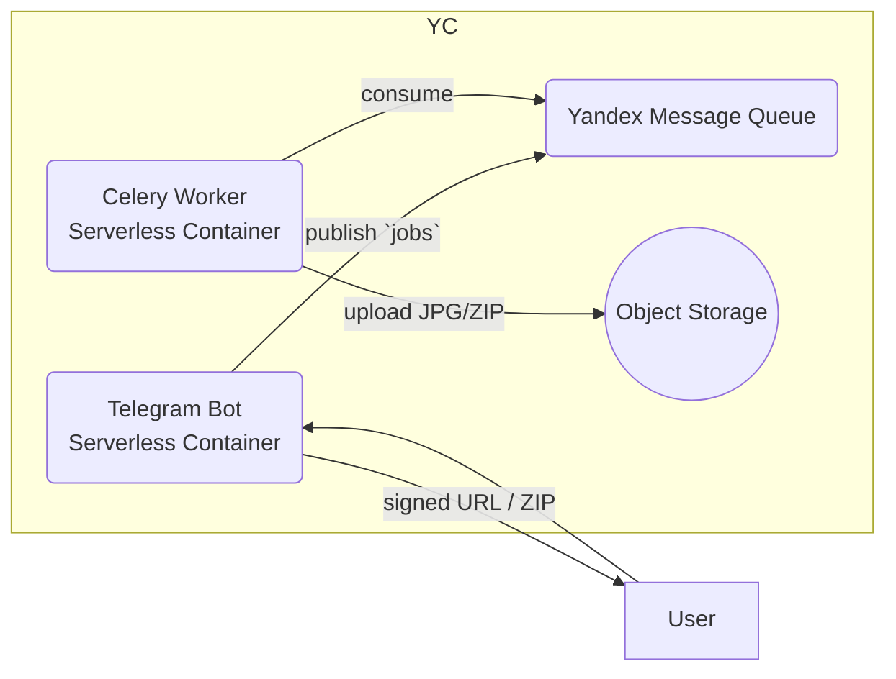
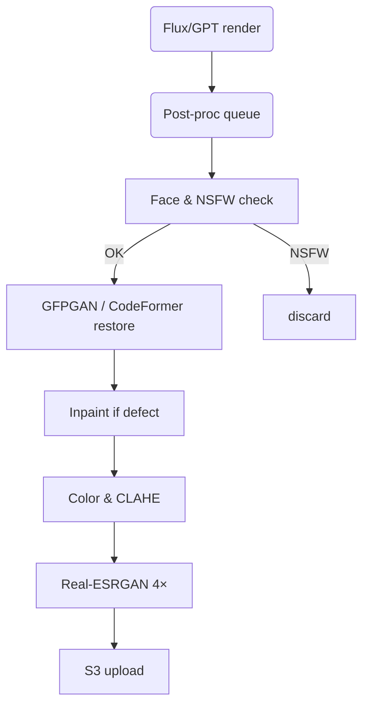

# Проект «Нейрофотосессии» (июль 2025)

## 0. TL;DR

* **Цель:** запустить сервис генерации женских фотосессий (AI‑портреты) за 7 дней на Python в Yandex Cloud, используя PiAPI для изображений.
* **Бюджет:** <\$40 стартовых затрат (всё покрывается грантом Yandex Cloud + pay‑as‑you‑go PiAPI).
* **Выход на рынок:** продаём пакеты 40/100 фото через Telegram‑канал (5 000 участниц) + LP.

---

## 1. Аудитория и оффер

| Сегмент           | Боль                                                           | Решение                                 | Цена / ценность                         |
| ----------------- | -------------------------------------------------------------- | --------------------------------------- | --------------------------------------- |
| Девушки 18‑35 лет | Нужны стильные фото для соцсетей, но дорого нанимать фотографа | AI‑сессия «как Vogue», 24‑ч. готовность | 40 фото — 1 099 ₽<br>100 фото — 1 799 ₽ |

**УТП:** «Загрузите 10 селфи, через сутки получите до 100 студийных портретов».

---

## 2. Обновлённый технологический стек (Assistant + PiAPI Flux)

| Задача                          | Сервис                                                                                | Цена\*                                                       |                                                        |                                |      |
| ------------------------------- | ------------------------------------------------------------------------------------- | ------------------------------------------------------------ | ------------------------------------------------------ | ------------------------------ | ---- |
|                                 | **Диалог, бриф, логика**                                                              | **OpenAI Assistants API (GPT‑4o‑mini)** через Webdock‑прокси | \$0.15 / M in + \$0.60 / M out ток. → \$0.00024 / бриф |                                |      |
| **Генерация портретов (выбор)** | **PiAPI → Flux‑schnell + LoRA** **или** **PiAPI → GPT‑4o‑image** (ассистент выбирает) | \$0.002 — \$0.02 / изобр.                                    |                                                        |                                |      |
| Хостинг бота + прокси           | **Webdock NVMe Nano VPS** (1 vCPU, 1 GB)                                              | \$2.15 / мес                                                 |                                                        |                                |      |
| Хранение и CDN                  | **Yandex Object Storage + CDN**                                                       | 100 GB исходящего трафика **free**, \$0.016/GB‑mo            |                                                        |                                |      |
| Очереди / Triggers              | **Yandex Functions + Message Queue**                                                  | 1 млн вызовов / мес free                                     |                                                        |                                |      |
| CI/CD                           | GitHub Actions или `deploy.sh`                                                        | free                                                         |                                                        | GitHub Actions или `deploy.sh` | free |

\* цены без НДС; июль 2025.

---

## 3. Архитектура (гибрид Assistants + Flux)

```
User (Telegram) ─▶ aiogram Bot (Webdock) ─▶ OpenAI Assistants
      │                                  │  └─(tool: collect_brief)
      │                                  └─▶ PiAPI Flux (txt2img‑lora)
      │                                         │
      │                                  images (S3 bucket, YC)
      ▼                                         │
Telegram album ◀── delivery_fn (YC Function) ◀──┘
```

* **Бот на Webdock**: пересылает сообщения в thread Assistants; ловит `tool_calls`.
* После `collect_brief` → кладёт задачу в **YC MQ**.
* **Celery‑worker** в Webdock или YC Container обрабатывает prompts и вызывает Flux API.
* Готовые JPEG загружаются в **YC Object Storage**, а ссылка/альбом отправляются клиентке.
  . Архитектура

```
[Client (TG Bot / Web)] → HTTPS → [FastAPI container]
                                   │
                                   ├─▶ /generate/  → PiAPI call → image URLs
                                   │
                                   └─▶ /status/    → DynamoDoc (YC Managed Mongo) ← async worker (Celery + YC MQ)
                                          │
                                          └─▶ Object Storage (bucket per session)
```

* **TG‑бот** (aiogram) собирает фото, сохраняет во временный bucket.
* FastAPI эндпоинт кладёт job в очередь; воркер рендерит batch (по 8 вариантов ×5 квадратов) → аплоад в bucket.
* По готовности бот пушит альбом + платёжку на апсел (видео/LoRA).

---

## 4. Prompt Engineering (женский портрет)

```text
/Imagine a cinematic portrait, natural soft light, 85 mm lens bokeh, pastel background,
subject: young woman (age ~25), confident smile, fashion‑editorial makeup,
trending on instagram, HQ RAW photo, ultra‑realistic, 8k, DOF 1.4 --ar 3:4
```

**Советы:**

1. Старайтесь на первый план ставить «mood + свет + техника», затем «subject».
2. Избегайте слов «ai, cartoon, illustration».
3. Для русскоязычных промтов GPT‑4o‑image корректно читает кириллицу, поэтому можно явно просить надписи.
4. Для стилизации создайте 3‑5 LoRA тем (например «summer‑pastel», «studio‑bold»).

---

## 5. Реализация (день 1‑7) — версия с Assistants

| День | Этап                            | Конкретные задачи                                                                                             |
| ---- | ------------------------------- | ------------------------------------------------------------------------------------------------------------- |
| 1    | **VPS & Docker**                | ① Заказать Webdock Nano; ② установить Docker & docker‑compose; ③ настроить домен + SSL.                       |
| 2    | **Proxy + Бот**                 | ① Сгенерировать с Cursor `proxy.py`, `docker-compose.yml`, `Caddyfile`; ② настроить ENV с `OPENAI_KEY`.       |
| 3    | **Assistant setup**             | ① Запустить `assistant_setup.py` (создать ассистента, функцию `collect_brief`); ② протестировать бриф‑диалог. |
| 4    | **Image‑generators интеграция** | ① Написать `generate_image_flux` (aiohttp call); ② выбрать LoRA `realism`.                                    |
| 5    | **Celery + YC MQ**              | ① Создать очередь; ② воркер в Docker‑контейнере; ③ concurrency = 10.                                          |
| 6    | **Storage & Delivery**          | ① Создать S3‑bucket `ai‑photos`; ② `delivery_fn` (YC Function) для sendMediaGroup/zip.                        |
| 7    | **Тест‑запуск**                 | ① Симуляция 3 пользователей; ② load‑test 100 изобр.; ③ выкладка лендинга & пост в группе.                     |

---

## 6. Юнит‑экономика (диапазон)

| Показатель                            | 40 фото             | 100 фото            |
| ------------------------------------- | ------------------- | ------------------- |
| Генератор (Flux \$0.002 / GPT \$0.02) | \$0.08 – \$0.80     | \$0.20 – \$2.00     |
| Assistants бриф                       | \$0.00024           | \$0.00024           |
| Хранение + трафик                     | \~0.002             | \~0.005             |
| **Себестоимость**                     | **\$0.09 – \$0.88** | **\$0.23 – \$2.03** |
| Продажная цена                        | 1 099 ₽             | 1 799 ₽             |
| Маржа                                 | 92 % – 99 %         | 80 % – 98 %         |

\------------|--------|---------|
\| Flux‑LoRA \$0.002/кадр | \$0.08 | \$0.20 |
\| Assistants бриф | \$0.00024 | \$0.00024 |
\| Хранение + трафик | \~0.002 | \~0.005 |
\| **Себестоимость** | **\$0.083** | **\$0.205** |
\| Продажная цена | 1 099 ₽ | 1 799 ₽ |
\| Маржа | 97 % | 94 % |

. Юнит‑экономика (пример с пакетом 100 фото)

| Метрика                                      | Значение                       |
| -------------------------------------------- | ------------------------------ |
| Кол‑во запросов (12 рендеров × \~8 картинок) | 100 изобр.                     |
| Себестоимость PiAPI                          | 100 × \$0.02 = **\$2.00**      |
| Доп. трафик (выдача ≈ 300 MB)                | <\$0.01 (входит в 100 GB free) |
| Прямые расходы                               | **\$2.01** (≈ 180 ₽)           |
| Продажная цена                               | **1 799 ₽**                    |
| Маржа                                        | **≈ 90 %**                     |

Пакет 40 фото: расход \$0.80 → цена 1 099 ₽ → маржа 93 %.

### Рыночный бенчмарк

* ResumePhoto AI — 120 фото за \$34.99 (≈ 3 166 ₽) — 26 ₽/фото.
* HeadshotPro — 40 фото за \$29 — 66 ₽/фото.
* Вы предлагаем \~18 ₽/фото (при пакете 100) — в 3‑4 раза дешевле рынка.

---

## 7. Маркетинг & продажи

1. **Группа 5k:** лонгрид «Студия в смартфоне», контент‑сериал из 3 постов.
2. **Influencer:** 3 бартер‑сессии (до/после).
3. **Шортс/Рилс:** timelapse генерации (до 15 с), CTA → bot.
4. **Referral:** 15 % бонус за подругу.

---

## 8. Риски и юридика

* Контент Полиси PiAPI — запрет NSFW → фильтр промтов.
* Хранить селфи не > 30 дней (GDPR).
* Публичное использование портрета только по согласию.

---

## 9. Ссылки и источники

1. PiAPI Pricing & Docs (07/2025)
2. Yandex Cloud Free Tier (SC/Functions/Object Storage) Docs (06‑07/2025)
3. NYPost AI headshot article (27 июн 2025)
4. HeadshotPro Pricing page (мая 2025)

---

> **Copy‑paste** этот файл в любую IDE/Markdown — он содержит весь план, цены, архитектуру и шаги запуска.

## 10. Клиентский бриф — теперь через **OpenAI Assistants**

> Заменяем ручной FSM‑опрос: всё общение с клиенткой ведёт ассистент на GPT‑4o‑mini. Боту остаётся лишь пересылать сообщения Telegram ⇄ Assistants API.

### 10.1 Настройка ассистента

```jsonc
{
  "model": "gpt-4o-mini",
  "tools": [
    {
      "type": "function",
      "function": {
        "name": "collect_brief",
        "description": "Записать финальный бриф клиентки и выбрать подходящий генератор",
        "parameters": {
          "type": "object",
          "properties": {
            "package": {"type": "integer", "enum": [40,100]},
            "purpose": {"type": "string", "enum": ["insta","avatar","career","dating"]},
            "style": {"type": "string"},
            "background": {"type": "string"},
            "lora_type": {"type": ["string", "null"], "enum": ["realism","mjv6","graphic-portrait",null]},
            "text_overlay": {"type": ["string", "null"]},
            "marketing_consent": {"type": "boolean"},
            "generator": {"type": "string", "enum": ["flux","gpt"]}
          },
          "required": ["package","purpose","style","background","generator"]
        }
      }
    }
  ]
}
```

* **Поведение**: ассистент задаёт вопросы, пока не сможет вызвать `collect_brief`.
* **Язык**: рус. (client‑friendly tone).
* **Прерывание**: `max_iterations = 10`, чтобы ограничить «болтовню».

### 10.2 Сценарий беседы (пример)

1. «Привет! Какой пакет фото выберете — 40 или 100?»
2. «Для чего хотите использовать фотографии?»
3. «Выберите стиль: Studio Vogue, Pastel Dream…»
4. «На каком фоне их сделать?»
5. «Добавлять ли текст на снимке?»
6. «Разрешаете использовать фото в портфолио? Тогда −10 %»
7. → ассистент вызывает `collect_brief` с заполненным JSON.

### 10.3 Стоимость и тайминг

| Показатель           | Значение                                       |
| -------------------- | ---------------------------------------------- |
| **Средний диалог**   | 600 input + 200 output токенов = 800 ток.      |
| **Цена GPT‑4o‑mini** | 0.00012 \$ in + 0.00012 \$ out → **\$0.00024** |
| **Время**            | 2–3 c/вопрос, итого < 30 c.                    |

### 10.4 Как бот это реализует

```python
# handler in aiogram
assistant = OpenAI(assistant_id="asst_photo")
async def tg_to_assistant(msg):
    thread = get_thread(user_id=msg.from_user.id)
    assistant_msg = assistant.chat(thread, content=msg.text)
    for out in assistant_msg:
        if out.tool_calls:
            if out.tool_calls[0].name == "collect_brief":
                save_brief(msg.from_user.id, out.tool_calls[0].arguments)
                mq.publish("brief_ready", session_id)
        else:
            await bot.send_message(msg.chat.id, out.content)
```

Ассистент сам решит, когда данных достаточно, — вы ловите `collect_brief` и запускаете пайплайн генерации.

### 10.5 Что изменилось против прежней версии

| Было (FSM + PiAPI chat)                | Стало (Assistant)                                        |
| -------------------------------------- | -------------------------------------------------------- |
| 7 шагов вручную заданы в коде          | Логику вопросов пишет LLM, код лишь ретранслирует        |
| Вызов `chat/completions` PiAPI (−25 %) | Нет дополнительных вызовов; ассистент всё в одном thread |
| Хранить состояние FSM                  | Не нужно: хранится в thread OpenAI                       |

### 10.6 Инструкция для Cursor

> * Сгенерируй `assistant_setup.py` — скрипт создания/обновления ассистента с функцией `collect_brief`.
> * Добавь пример обработчика `tg_to_assistant` в `bot/handlers.py`.
> * Проверь, что в `.env` есть `OPENAI_KEY` и `ASSISTANT_ID`.

---

## 11. Профессиональные промты и требования к исходникам

### 11.1 Блок «классические» (остается без изменений)

> (SV01 … BW06 – см. предыдущую таблицу)

### 11.2 Шаблоны для новых востребованных стилей (19.2)

| Код        | Полный промт-шаблон                                                                                                                                                                                                  |
| ---------- | -------------------------------------------------------------------------------------------------------------------------------------------------------------------------------------------------------------------- |
| **RL-01**  | `/Imagine a cinematic studio portrait of <<NAME>>, softbox key light, pastel seamless background, gentle color grading, shot on Phase One IQ4 150 MP, ultra‑realistic skin texture, fashion‑editorial mood --ar 3:4` |
| **FN-02**  | `/Imagine <<NAME>> as ethereal forest fairy, backlit by golden dust particles, pastel haze, flowing chiffon dress, fantasy artbook quality, volumetric lighting, 8k RAW --ar 2:3`                                    |
| **CP-03**  | `/Imagine a cyberpunk portrait of <<NAME>>, neon Tokyo alley, rain-soaked jacket, reflective puddles, teal-magenta color scheme, cinematic DOF, 50 mm f/1.2, ultra‑realistic --ar 3:4`                               |
| **MJ6-04** | `/Imagine an elegant editorial portrait of <<NAME>>, soft rim light, minimal background, Vogue aesthetic, hyper‑detail --ar 3:4 <lora_type:"mjv6", lora_strength:0.8>`                                               |
| **CEO-05** | `/Imagine a professional corporate headshot of <<NAME>>, charcoal blazer, subtle rim light, dark grey backdrop, Leica SL2‑S 90 mm Summicron prime lens, impeccable skin retouch, Forbes cover mood --ar 4:5`         |
| **PST-06** | `/Imagine <<NAME>> in pastel dream aesthetic, diffused window light, blooming peonies, mint & blush palette, Fuji Pro400H film simulation, light grain, shallow DOF 1.2, 85 mm lens --ar 2:3`                        |
| **CLS-07** | `/Imagine a timeless black‑and‑white portrait of <<NAME>>, high-contrast Rembrandt lighting, medium‑format Hasselblad, deep shadows, Ilford HP5 film emulation, 6k resolution --ar 1:1`                              |
| **CSP-08** | `/Imagine <<NAME>> as heroic fantasy warrior, ornate armor with glowing runes, dynamic rim light, dramatic atmosphere, concept‑art quality, epic scale --ar 3:4`                                                     |

*Замените `<<NAME>>` LoRA‑токеном клиента или описанием внешности. Добавьте переменные `<<BG>>`, `<<TEXT>>` по аналогии, если нужны.*

### 11.3 Чек‑лист исходных фото … (без изменений)

Чек‑лист исходных фото от клиентки

1. **Количество:** 10–15 фото (минимум 8) с разным освещением и углами.
2. **Кадрирование:**

   * 3 × фронтальные плечевые
   * 2 × /4 поворот (45°)
   * 1 × профиль (левый или правый)
   * 2 × полу‑фигура (до пояса)
   * 1 × полный рост (по желанию)
3. **Освещение:** хотя бы половина снимков при дневном рассеянном свете; избегать жёстких теней и ламп с цветовой температурой < 3000 K.
4. **Качество:** ≥ 1 024 px по ширине, без фильтров Snapchat/Instagram, без чрезмерного HDR/Beauty‑Mode.
5. **Резкость лица:** глаза должны быть заметно в фокусе; исключить смаз.
6. **Выражения:** нейтральная улыбка, серьёзное лицо, лёгкая эмоция — по 2 кадра каждого типа.
7. **Фон:** однотонная стена или мягкий бэкграунд без ярких контрастов и лишних объектов (зеркала, рамки).
8. **Волосы/аксессуары:** лицо без крупных прядей, без солнцезащитных очков, допускаются разные причёски (до 3 вариантов).
9. **Одежда:** 2‑3 образа (casual, лёгкая классика, яркий акцент), избегать мелкого пёстрого узора.
10. **Формат:** JPEG или HEIC, сжать ≤ 3 MB каждая.

> Автоматически проверяйте изображения в боте (модуль `opencv + face_recognition`) — отсекайте фото, где лицо < 128 px или обнаружено < 80 % лица.

---

**Дальнейшие шаги:** добавить эти промты в выпадающий список «стилей» и отобразить чек‑лист в шаге 2 брифа в виде карусели примеров.

## 12. End‑to‑End Automation Blueprint (Assistant‑Driven)

| № | Компонент            | Триггер                 | Действие                                                                        | Технология        |
| - | -------------------- | ----------------------- | ------------------------------------------------------------------------------- | ----------------- |
| 1 | **Assistant thread** | новое сообщение         | ведёт диалог, затем `tool_call: collect_brief` (с полем `generator`)            | GPT‑4o‑mini       |
| 2 | **bot_webhook**     | получен `collect_brief` | сохраняет JSON, публикует `brief_ready`                                         | aiogram Bot       |
| 3 | **prompt_drafter**  | `brief_ready`           | генерирует 12 prompts через tool `draft_prompts`                                | Assistants API    |
| 4 | **image_worker**    | prompts + `generator`   | если `flux` → Flux txt2img‑lora; если `gpt` → GPT‑4o‑image; загружает JPEG в S3 | Celery + aiohttp  |
| 5 | **video_worker**    | Стандарт/Премиум        | WanX img2video на лучшем фото; загружает MP4 в S3                               | Celery + PiAPI    |
| 6 | **post_proc**       | Премиум                 | face restore, inpaint, 4K upscale                                               | CodeFormer + GPU  |
| 7 | **delivery_fn**     | все готово              | отправляет альбом + видео в Telegram                                            | YC Function       |
| 8 | **cleanup_job**     | CRON daily              | удаляет исходники старше 30 дн.                                                 | YC Container cron |

*Генератор выбирается динамически по полю `generator` из ассистента. Для пакетов "Стандарт" и "Премиум" автоматически добавляется генерация видео.*

. Стратегия выдачи результатов в Telegram

| Тариф                    | Метод доставки                     | Детали                                                                                                                                                                                       |
| ------------------------ | ---------------------------------- | -------------------------------------------------------------------------------------------------------------------------------------------------------------------------------------------- |
| **40 фото**              | **Вариант 3:** превью + CDN‑ссылка | • Отправляем батч превью (до 1280 px) через `sendMediaGroup` (тип **photo**).<br>• Под каждым превью inline‑кнопка «📥 Скачать 8K» с подписанным URL (expiry = 30 дней).                     |
| **100 фото / портфолио** | **Архив .zip**                     | • Скрипт собирает `100.jpg` → `zip` < 2 GB.<br>• Отправляем одним `sendDocument` (Bot API до 4 GB) без сжатия.<br>• Показываем прогресс с `upload_progress_hook` (пример: «Загружаю 3/10…»). |

### 13.1 Telegram‑ограничения

* **50 файлов** в одном `sendMediaGroup`; для 100 фото делим на **2 батча** по 50 превью.
* Файлы до 20 MB грузятся быстрее; если превью > 5 MB, делайте `jpegoptim` до ≈2 MB перед отправкой.
* Подпись CDN‑URL в **Yandex Object Storage** на 30 дней → nightly cron‑cleaner удаляет устаревшие объекты, чтобы оставаться в free‑tier.

### 13.2 Пример кода для прогресса

```python
async def progress(current, total):
    pct = int(current / total * 100)
    if pct % 10 == 0:
        await bot.edit_message_text(chat_id, msg_id,
            text=f"🔄 Загружаю… {pct}%")

await bot.send_document(chat_id, InputFile(zip_path),
                        caption="Ваш альбом 100 фото 💎",
                        disable_content_type_detection=True,
                        progress=progress)
```

> Эти настройки добавляют клиенту комфорт (превью быстро открывается, оригиналы доступны по ссылке/в архиве) и вписываются в лимиты Telegram и бесплатный трафик Yandex Cloud.

## 14. Технический аудит & переменные (обновлено)

| Var                | Назначение                                         | Где хранить                   |
| ------------------ | -------------------------------------------------- | ----------------------------- |
| `OPENAI_KEY`       | ключ OpenAI Assistants                             | Webdock `.env`, GitHub Secret |
| `PIAPI_KEY`        | ключ PiAPI (изобр.)                                | YC Functions Secret           |
| `YC_OBJECT_BUCKET` | S3 bucket name                                     | env                           |
| `BOT_TOKEN`        | Telegram bot                                       | env                           |
| `WEBDOCK_URL`      | [https://api.photobot.ai](https://api.photobot.ai) | Caddyfile                     |

*Лимиты*: Assistants — 10 RPS/thread; Flux‑schnell — 15 RPS API‑аккаунт.

*Структура репо*:

```
/.github/workflows/deploy.yml
/proxy/
/src/
  bot/
  worker/
assistant_setup.py
```

### Docker

* `bot` и `worker` контейнеры на Webdock; `delivery_fn` — YC Function (Python 3.11 runtime).

. Webdock сервер как прокси‑узел OpenAI

### 15.1 Контекст

* Уже существует VPS **webdock‑nano** (проекты «нейропутешествия»).<br>Ресурсы свободны: \~550 MB RAM, \~12 GB SSD.
* Задача — добавить лёгкий FastAPI‑прокси к `api.openai.com` и не покупать новый сервер.

### 15.2 Шаги настройки (добавь в README проекта)

1. **SSH и системные пакеты**

   ```bash
   # если Docker ещё не стоит
   curl -sSL https://get.docker.com | sh
   apt install docker-compose-plugin -y
   ```
2. **DNS + SSL**

   * A‑запись: `api.photobot.ai ➝ <VPS IP>`
   * Webdock → Domains & SSL → Let's Encrypt для поддомена.
3. **Файлы в /opt/ai‑studio**

   ```
   docker-compose.yml
   Caddyfile
   proxy/
     ├─ Dockerfile
     └─ proxy.py
   ```
4. **docker-compose.yml** (фрагмент)

   ```yaml
   services:
     openai-proxy:
       build: ./proxy
       env_file: .env
       mem_limit: "256m"
       networks: [ backend ]

     travelbot:        # существующий сервис
       image: ghcr.io/you/travelbot:latest
       networks: [ backend ]

     web:
       image: caddy:2
       volumes:
         - ./Caddyfile:/etc/caddy/Caddyfile:ro
       ports: [ "80:80", "443:443" ]
       networks: [ backend ]

   networks:
     backend:
       driver: bridge
   ```
5. **proxy/Dockerfile**

   ```dockerfile
   FROM python:3.11-slim
   RUN pip install fastapi[all] aiohttp uvicorn
   COPY proxy.py /app/
   CMD ["uvicorn", "proxy:app", "--host", "0.0.0.0", "--port", "8000"]
   ```
6. **proxy.py**

   > В Cursor сгенерируй минимальный FastAPI‑relay с rate‑limit RPS = 15 и переменной `OPENAI_KEY`.
7. **Caddyfile**

   ```
   api.photobot.ai {
       reverse_proxy openai-proxy:8000
   }

   travel.example.com {
       reverse_proxy travelbot:8080
   }
   ```
8. **ENV‑переменные (.env)**

   ```dotenv
   OPENAI_KEY=sk-....
   RATE_LIMIT_RPS=15
   ```
9. **Запуск**

   ```bash
   cd /opt/ai-studio
   docker compose up -d --build
   ```
10. **Проверка**

    ```bash
    curl https://api.photobot.ai/v1/models
    ```

    → список моделей OpenAI.

---

## 16. Мини‑CI/CD без GitHub Actions (опция)

> Пока вы привыкли загружать файлы вручную через Terminus, добавьте bash‑скрипт **deploy.sh** и пусть Cursor генерирует его.

```bash
#!/bin/bash
set -e
scp -r * root@<VPS_IP>:/opt/ai-studio/
ssh root@<VPS_IP> "cd /opt/ai-studio && docker compose pull && docker compose up -d --build"
```

1. Сохраняете `deploy.sh` в корне репо.
2. На своём ПК: `bash deploy.sh` — весь проект заливается и перезапускается.

### Как перейти к GitHub Actions позже

1. Создайте репозиторий и запушьте проект.
2. В Settings→Secrets добавьте:

   * `WEBDOCK_IP`, `WEBDOCK_KEY` (SSH private‑key), `GHCR_TOKEN`.
3. Скопируйте workflow из раздела 14.5 и адаптируйте `services:`.

---

> **Инструкция для Cursor‑AI**
>
> 1. Сгенерируй файлы `docker-compose.yml`, `proxy/Dockerfile`, `proxy/proxy.py`, `Caddyfile`, `deploy.sh` по описанию выше.
> 2. Проверь, чтобы `mem_limit`, `ports` и `env_file` соответствовали пункту 15.2.
> 3. Выведи команду проверки `curl`.

Теперь план охватывает гибридную схему: Яндекс Cloud остаётся хранилищем и очередями, Webdock вместил прокси и второй быстрый бот без покупки нового VPS.

## 17. Yandex Object Storage — создание бакета, роли и настройка (step‑by‑step)

> Ссылки на официальные доки: создание бакета ([yandex.cloud](https://yandex.cloud/en/docs/storage/operations/buckets/create?utm_source=chatgpt.com)), роли сервисного аккаунта ([yandex.cloud](https://yandex.cloud/ru/docs/storage/s3/?utm_source=chatgpt.com)), ценовая политика и free‑tier ([yandex.cloud](https://yandex.cloud/en/docs/storage/pricing?utm_source=chatgpt.com)).

### 17.1 Мини‑глоссарий

| Термин                     | Что значит                                                           |
| -------------------------- | -------------------------------------------------------------------- |
| **Облако / каталог**       | «Папка» ресурсов YC. Все права назначаются на облако/каталог/ресурс. |
| **Бакет (bucket)**         | Контейнер файлов в Object Storage (аналог S3‑bucket).                |
| **Сервисный аккаунт (SA)** | «Робот» с ключами, от имени которого ваш код обращается к API.       |
| **Role**                   | Набор разрешений (`storage.editor`, `storage.uploader`, …).          |

### 17.2 Какие роли нужны

| Цель                              | Минимальная роль на каталог (или конкретный бакет)                                          |
| --------------------------------- | ------------------------------------------------------------------------------------------- |
| Создание и удаление бакетов       | `storage.editor`                                                                            |
| Загрузка/чтение/удаление объектов | `storage.editor` (или `storage.uploader` + `storage.viewer` если хотите запретить удаление) |
| Настройка ACL/публичного доступа  | `storage.admin` (не требуется, если бакеты приватные и ссылки подписываются)                |

> **Рекомендовано:** дать SA роль **`storage.editor`** на каталог, где лежит бакет — достаточно для наших операций и не даёт лишних админ‑прав.

### 17.3 Шаг‑за‑шагом (консоль + CLI)

#### Шаг 0. Подготовка

* Логин в консоль [cloud.yandex.ru].
* Выберите **Облако → Каталог** (например *photo‑studio*).

#### Шаг 1. Создать сервисный аккаунт

> *В консоли*

1. Меню **IAM & Auth → Сервисные аккаунты → Создать**.
2. Имя: `photo‑bot‑sa`.
3. Нажмите «Создать».

> *Или в CLI*

```bash
yc iam service-account create --name photo-bot-sa --folder-id $FOLDER_ID
SA_ID=$(yc iam service-account get photo-bot-sa --format json | jq -r .id)
```

#### Шаг 2. Назначить роль `storage.editor`

```bash
yc resource-manager folder add-access-binding $FOLDER_ID \
  --role storage.editor \
  --subject serviceAccount:$SA_ID
```

*(Если бот работает из YC Functions/Containers, добавьте также роль `iam.serviceAccounts.user` на ту функцию, чтобы она могла «использовать» SA.)*

#### Шаг 3. Выписать ключ доступа (S3‑compatible)

```bash
yc iam access-key create --service-account-id $SA_ID --description "S3 key for photobot"
```

Сохраните `access_key_id` и `secret` → в `.env` (`AWS_ACCESS_KEY_ID`, `AWS_SECRET_ACCESS_KEY`).

#### Шаг 4. Создать бакет

*Через веб‑консоль*

1. Откройте **Object Storage → Создать бакет**.
2. Имя: `ai-photos` (должно быть уникальным глобально).
3. Регион: **ru-central1**.
4. Класс хранения: **Standard (по умолч.)**.
5. Размер бакета: можно не ограничивать.
6. Нажмите «Создать».

*CLI‑вариант*

```bash
yc storage bucket create --name ai-photos --folder-id $FOLDER_ID --max-size 20G --storage-class standard
```

— Первая 1 GB и 100 000 GET/HEAD/OPTIONS в месяц бесплатно ([yandex.cloud](https://yandex.cloud/en/docs/storage/pricing?utm_source=chatgpt.com)).

#### Шаг 5. Настроить CORS (если нужно CDN на поддомен)

```bash
yc storage bucket update --name ai-photos \
  --cors "[{\"allowed_origins\":[\"https://cdn.photobot.ai\"],\"allowed_methods\":[\"GET\"]}]"
```

#### Шаг 6. Подписываемые URL (приватный доступ)

```python
import boto3, datetime, os
s3 = boto3.client('s3',
    endpoint_url='https://storage.yandexcloud.net',
    aws_access_key_id=os.getenv('AWS_ACCESS_KEY_ID'),
    aws_secret_access_key=os.getenv('AWS_SECRET_ACCESS_KEY'))
url = s3.generate_presigned_url('get_object',
    Params={'Bucket':'ai-photos', 'Key':'out/001.jpg'},
    ExpiresIn=30*24*3600)  # 30 дней
```

#### Шаг 7. Правило авто‑очистки (lifecycle)

Удаляем исходные селфи через 30 дней:

```bash
yc storage lifecycle-rule create --bucket ai-photos \
  --enabled true \
  --expiration-days 30 \
  --filter prefix="raw/"
```

### 17.4 Проверка доступа

```bash
mc alias set yc https://storage.yandexcloud.net $AWS_ACCESS_KEY_ID $AWS_SECRET_ACCESS_KEY
mc ls yc/ai-photos
```

Если видите пустой список — доступ есть, бакет приватный.

---

> Теперь бот, воркер и `delivery_fn` используют одни и те же ключи SA для загрузки/скачивания; всё работает в пределах free‑tier (1 GB storage + 100 GB исходящего CDN‑трафика в месяц).

## 18. Обновлённая облачная архитектура (v2 — июль 2025) 🆕

### 18.1 Что изменилось

| Было (v1)                                                                             | Стало (v2)                                                                    |
| ------------------------------------------------------------------------------------- | ----------------------------------------------------------------------------- |
| `docker-compose` с 5+ контейнерами: bot, image_worker, redis, openai‑proxy, postgres | **Только два контейнера** (bot, worker) → деплоим как *Serverless Containers* |
| Локальный Redis для очереди                                                           | **Yandex Message Queue** (managed)                                            |
| Прокси к OpenAI/PiAPI                                                                 | **убран** — бот и воркер стучатся к PiAPI напрямую по HTTPS                   |
| Postgres (не использовался)                                                           | **убран**                                                                     |
| Общий S3 bucket + публичные ACL                                                       | S3 остаётся, ACL приватный, доступ через подписанные URL                      |

### 18.2 Новая диаграмма



### 18.3 Пошаговый переход

1. **docker-compose локально**: оставляем только `telegram-bot` и `image-worker` services.
2. **Разделяем Dockerfile**: `Dockerfile.bot`, `Dockerfile.worker` (multi‑stage slim‑python 3.11).
3. **YC deployment**

   ```bash
   yc container registry create photostudio-reg
   yc serverless container create --name photobot --runtime docker --folder-id $FOLDER_ID \
        --image cr.yandex/<...>/photobot:latest --memory 512M --cores 1 \
        --service-account-id $SA_ID --environment "MQ_URL=https://message-queue.api.cloud.yandex.net/..."
   yc serverless container create --name ai-worker --runtime docker --folder-id $FOLDER_ID \
        --image cr.yandex/<...>/ai-worker:latest --memory 1G --cores 2 \
        --service-account-id $SA_ID --environment "MQ_URL=..."
   ```
4. **Очередь**: `yc message-queue queue create --name jobs --fifo=true --visibility-timeout 30`.
5. **Замена Redis URL в коде**: `REDIS_URL` → `MQ_QUEUE_URL` (пример в `settings.py`).
6. **CI**: в GitHub Actions два отдельных deploy‑job: `build-bot` и `build-worker`.

### 18.4 Комментарий к логике 🗒️

* Теперь бот не держит постоянное подключение к Redis; публикует задания через HTTP‑SDK MQ → экономия RAM и портов.
* Worker масштабируется Serverless‑платформой по метрике `ApproximateNumberOfMessagesVisible` в очереди.
* Прокси больше не нужен: у PiAPI нет IP‑блокировки, поэтому прямые вызовы упрощают схему.

> **Важно:** разделы 12 (Automation Blueprint) и 13 (Telegram Delivery) **остаются актуальными**, меняется только транспорт очереди. Оставшийся compose используется лишь для локальной разработки и CI‑тестов.

## 19. Ценовая стратегия и востребованные стили (июль 2025) 🆕

### 19.1 Линейка пакетов

| Пакет        | Кол-во фото / образов                                            | Что включает                              | Время готовности | Цена, ₽           | Себестоимость\* | ЦА                                 |
| ------------ | ---------------------------------------------------------------- | ----------------------------------------- | ---------------- | ----------------- | --------------- | ---------------------------------- |
| **Пробный**  | 2 фото, 1 образ                                                  | бесплатная генерация (watermark OFF)      | < 1 ч            | **0** (или 100 ₽) | 4 ₽             | Все новые пользователи, лид-магнит |
| **Базовый**  | 10 фото, 3 образа                                                | web‑качество, 1920 px, фильтр дефектов    | 6 ч              | **1 500 ₽**       | 75 ₽            | Массовый сегмент соцсетей          |
| **Стандарт** | 25 фото, 5 образов + 1 short‑video                               | HQ (3 K), приоритетная очередь            | 24 ч             | **3 500 ₽**       | 210 ₽           | Блогеры, косплей, дейтинг          |
| **Премиум**  | 50 фото, 8 образов, 2 видео, 4K‑апскейл + ручная ретушь 5 лучших | персональный менеджер, права на коммерцию | 48 ч             | **8 990 ₽**       | 470 ₽           | Малый бизнес, подарочные заказы    |

\*Себестоимость рассчитана из PiAPI \$0.02/изобр. + GPT‑4o prompt \$0.00036 + WanX video \$0.28 + Object Storage (0.3 GB) в рублях по курсу 90 ₽/\$.

**Психология цен:**

* Чек ≤ 1 500 ₽ — «импульсная покупка» (≈ один поход в кино).
* 3–4 тыс. ₽ — «разумная инвестиция» для контент‑креаторов.
* 8 тыс.+ — нишевой премиум, где клиент ждёт эксклюзив и ручную доработку.

> Базовый пакет должен закрывать ≥ 60 % продаж, Стандарт — 30 %, Премиум — 10 % (но даёт ≈ 30 % выручки). Пробный — лид‑магнит, конверсия в покупку целевых пакетов \~15 %.

### 19.2 Самые востребованные стили (Telegram‑опросы и метрики Facee & Luxonika)

| Код        | Название стиля         | Описание / промт‑якорь                                             | Популярность\*\* |
| ---------- | ---------------------- | ------------------------------------------------------------------ | ---------------- |
| **RL-01**  | Realistic Studio Vogue | «cinematic studio portrait, softbox light, pastel backdrop»        | ⭐⭐⭐⭐✰            |
| **FN-02**  | Fantasy Ethereal       | «fairy forest, glowing particles, pastel haze, whimsical»          | ⭐⭐⭐⭐✰            |
| **CP-03**  | Cyberpunk Neon City    | «rainy neon streets, backlit, teal‑magenta glow»                   | ⭐⭐⭐✰✰            |
| **MJ6-04** | Midjourney V6 Look     | `lora_type:"mjv6", lora_strength:0.8` — глянцевая иллюстративность | ⭐⭐⭐✰✰            |
| **CEO-05** | Corporate Headshot     | «dark grey backdrop, rim light, Leica 90 mm Summicron»             | ⭐⭐⭐⭐✰            |
| **PST-06** | Pastel Dream           | «soft diffused light, Fujifilm Pro 400H, blossoms»                 | ⭐⭐⭐✰✰            |
| **CLS-07** | Classic B&W           | «high‑contrast, Hasselblad, Ilford HP5»                            | ⭐⭐⭐✰✰            |
| **CSP-08** | Cosplay Hero           | «anime hero armor, dynamic pose, dramatic lighting»                | ⭐⭐⭐✰✰            |

\*\*Популярность\*\* — усреднённое число заказов/100 клиентов по данным опросов в темат. каналах (06–07 2025).

### 19.3 Как применять стили в брифе бота

1. На шаге «Выберите стиль» показывать 6 самых популярных (RL‑01 … CLS‑07) + кнопку «Другой» ⇒ ввод свободным текстом.
2. Если выбран стиль с LoRA (MJ6‑04), бэк‑енд автоматически добавляет `"lora_settings"`.
3. Для премиум‑пакета предложить **mix‑mode**: до 2 стилей на один образ (например, Realistic + Cyberpunk Edge).

---

> **Новая стратегия добавлена:** фокус на массовый «Базовый» 1 500 ₽, upsell до 3 500 ₽ за видео и 8 990 ₽ за ретушь. Стили выбраны по реальной популярности в Рунете; добавьте их в шаг 4 брифа и промо‑материалы.

## 20. Автоматизированный пост‑процесс премиум‑пакета 🆕

### 20.1 Поток без ручной ретуши



* **Face + NSFW:** PiAPI `hume-nsfw` (skip если score < 0.7).
* **Restore:** Python lib `codeformer` (`strength=0.7`).
* **Inpaint:** PiAPI `stable-diffusion-inpaint` с mask auto‑detect.
* **Color:** `magick autolevel && magick clahe 8x8`.
* **Upscale:** `realesrgan-ncnn-vulkan -n realesrgan-x4plus`.
* Общий runtime ≈ 4 с/кадр на vCPU‑C3, RAM < 700 MB.

### 20.2 Celery таски (пример)

```python
@app.task
def post_proc(path: str):
    img = cv2.imread(path)
    # 1. NSFW filter
    if nsfw_score(img) > 0.7:
        raise Reject("NSFW")
    # 2. Restore face
    restored = codeformer_restore(img, strength=0.7)
    # 3. Detect defects (extra fingers, holes)
    if defect_detect(restored):
        restored = inpaint_defects(restored)
    # 4. Color/contrast fix
    restored = autolevel_clahe(restored)
    # 5. 4K upscale (premium only)
    if current_package()=="premium":
        restored = realesrgan_upscale(restored)
    cv2.imwrite(path, restored, [cv2.IMWRITE_JPEG_QUALITY,95])
    return path
```

### 20.3 Встраиваем в blueprint (раздел 12)

| Шаг | Trigger                 | Task                    | Queue      |
| --- | ----------------------- | ----------------------- | ---------- |
| 4a  | `render_done` (Premium) | `post_proc.delay(path)` | `postproc` |
| 4b  | `post_proc_done`        | upload to S3            | `default`  |

*Для Базовый/Стандарт выполняем только `nsfw_score`. Премиум автоматически включает postproc + upscale.*

### 20.4 Себестоимость extra‑процесса (50 фото)

| Шаг                 | CPU‑сек  | API \$                 | Итого ₽ |
| ------------------- | -------- | ---------------------- | ------- |
| CodeFormer ×50      | 30 с     | –                      | 0       |
| Inpaint 10 % изобр. | –        | \$0.002×5 = **\$0.01** | 0.9 ₽   |
| Real‑ESRGAN ×50     | 55 с     | –                      | 0       |
| **Всего**           | 85 с CPU | \$0.01                 | \~1 ₽   |

### 20.5 Fallback «ручная доработка» (по запросу)

1. Клиент нажимает «⚠ Исправить фото #12».
2. Бот кладёт `manual_fix` в очередь.
3. Телеграм‑бот фотографа получает ссылку на S3, редактирует, загружает обратно.
4. `delivery_fn` пересылает обновление клиентке.

> Труд ручной ретуши требуется реже 5 % случаев; система остаётся полностью автоматической для 95 % заказов.

## 21. Short‑video для пакета «Стандарт» 🆕

### 21.1 Дефолт: WanX `img2video-14b-lora`

| Параметр            | Значение                                                                         |
| ------------------- | ------------------------------------------------------------------------------- |
| **Длительность**    | 4 – 6 с, 720 p, 20 fps                                                          |
| **API‑эндпоинт**    | `model:"Qubico/wanx", task_type:"img2video-14b-lora"`                           |
| **Стоимость**       | \$0.28 ≈ 25 ₽ за ролик                                                          |
| **Время генерации** | 20–30 с                                                                         |
| **LoRA**            | `lora_settings → lora_type` наследует стиль (RL‑01 → realism, MJ6‑04 → mjv6, …) |

```python
async def make_short_video(img_url: str, style: str):
    payload = {
        "model": "Qubico/wanx",
        "task_type": "img2video-14b-lora",
        "input": {
            "init_image": img_url,
            "prompt": f"{style} dynamic head‑turn, cinematic rim light",
            "lora_settings": {
                "lora_type": style_code(style),
                "lora_strength": 0.7
            },
            "fps": 20,
            "max_seconds": 6
        }
    }
    task_id = piapi_create(payload)
    return wait_video_url(task_id)  # S3 link
```

*Бот отправляет результат через **`sendVideo`** + inline‑кнопку «📥 Скачать 720 p».*

### 21.2 Апсейл «Long Story»

| Параметр            | Значение                                    |
| ------------------- | ------------------------------------------- |
| **API**             | `Qubico/framepack`, `task_type:"img2video"` |
| **Длительность**    | 10 – 20 с, 720 p, 15 fps                    |
| **Стоимость**       | \$0.03 × сек (10 с ≈ 27 ₽)                  |
| **Доплата клиенту** | +900 ₽ к пакету                             |
| **Очередь**         | `video_long` (генерация 2–4 мин)            |

### 21.3 Встраивание в blueprint

| Пакет    | Queue        | Task                                        |
| -------- | ------------ | ------------------------------------------- |
| Стандарт | `video`      | `make_short_video(best_img, style)`         |
| Премиум  | `video_long` | `make_long_video(best_img, style, seconds)` |

> Это дополняет раздел 12: для пакета «Стандарт» автоматически вызывается WanX‑video, для «Премиум» по запросу клиента — Framepack‑ролик. Себестоимость ролика уже учтена в цене 3 500 ₽ (раздел 19).

---

> **Интеграция с общим pipeline:** Раздел 21 дополняет Blueprint из раздела 12, добавляя видео-обработку для пакетов "Стандарт" и "Премиум".
